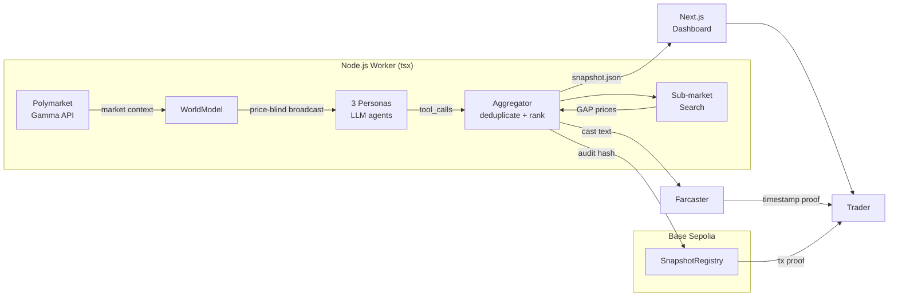
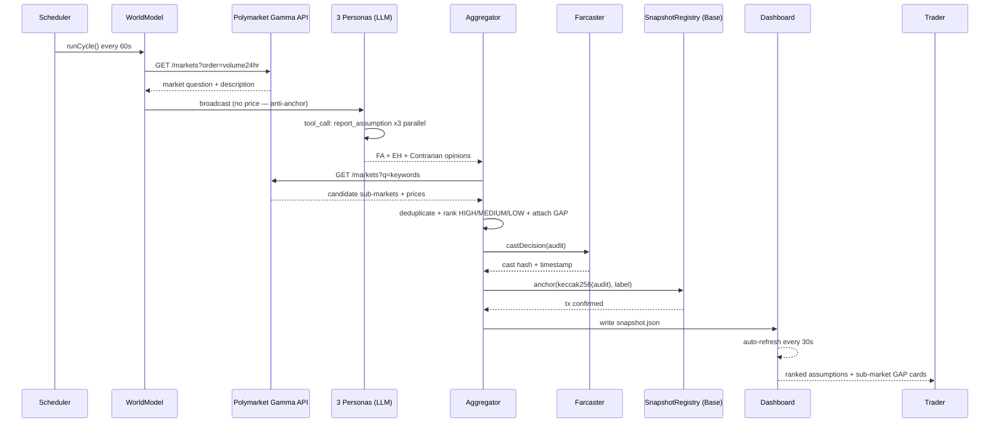

<h1 align="center">Faultline</h1>

<p align="center">
  <strong>Seismograph for prediction markets — surface hidden assumptions before one breaks</strong>
</p>

<p align="center">
  <a href="https://hackcamp-w2-faultline.vercel.app">Live Demo</a> ·
  <a href="https://sepolia.basescan.org/address/0x04Ac696E4075D439841bb75b30ddEA7Cea27a67D#events">On-chain Audit Log</a> ·
  <a href="https://github.com/programmeryuanyuan/hackcamp-w2-faultline">GitHub</a> ·
  <a href="./README.zh-CN.md">中文版</a>
</p>

<p align="center">
  
  
  
</p>

---

## The Problem & The Solution

A prediction market at 65% isn't saying "65% of people think it happens." It's saying: *a set of hidden assumptions all hold simultaneously*. Let one fault line slip — the price collapses overnight. The traders who 4x'd that night weren't watching the price. They were watching what the price was **betting on**.

Existing tools give you more probability estimates. None tell you what those probabilities are built on. Worse: feed an LLM the market price first and it anchors — consensus gets smuggled in through the back door.

**Faultline runs three price-blind AI analysts through every prediction market.** No anchoring. No consensus. Fundamentals Analyst, Event Horizon, and Contrarian each read the same market — without ever seeing the price — and surface one fragile hidden assumption ranked HIGH, MEDIUM, or LOW. The audit is published to **Farcaster** and anchored on **Base** *before* the event resolves. Not a screenshot — an immutable on-chain record that proves you called it first.

---

## Demo

**Live dashboard:** [https://hackcamp-w2-faultline.vercel.app](https://hackcamp-w2-faultline.vercel.app)
Auto-refreshes every 30 seconds. No login required.

**Demo video:** Coming D18 — full walkthrough: market input → 3 personas → ranked assumptions → sub-market GAP → on-chain TX.

**On-chain proof:** Every audit cycle writes a `SnapshotAnchored` event to Base Sepolia. Verify it now:
[`0x04Ac...a67D`](https://sepolia.basescan.org/address/0x04Ac696E4075D439841bb75b30ddEA7Cea27a67D#events)

---

## How It Works

### Architecture



### Core Flow



### Why This Stack

- **Price-blind agents:** each persona receives only the market question and description — price is stripped from the LLM prompt at the source, not via a system-prompt instruction the model might ignore
- **Function calling over free-form chat:** `report_assumption` tool call enforces structured output (assumption, fragility, breakingEvent, timeToBreak) — 10× more reliable than parsing chat text
- **Zero database:** audit results live in `snapshot.json`; `SnapshotRegistry` events are the immutable audit trail — judges verify on-chain events, not a table schema

---

## Output Example

```
[1] HIGH   "Iran's Supreme Leader must remain in power through the deadline"
    Breaking event: Leadership transition or incapacitation
    When: Within 30 days
    Sub-market: "Will Khamenei remain Supreme Leader through June?" → 78% (GAP +21%)

[2] MEDIUM  "US domestic politics allows a deal before expiry"
    Breaking event: Congressional backlash blocks ratification
    When: 2–4 weeks
    Sub-market: none found

[3] LOW    "Neither side walks away under domestic pressure"
    Breaking event: Iranian hardliner factions force withdrawal
    When: 1–3 months
```

---

## Tech Stack

| Layer | Tech | Why |
|-------|------|-----|
| Smart contracts | Solidity (deployed via Remix) | event-only, zero storage, minimal gas |
| Chain | **Base Sepolia → Base Mainnet** | EVM + Coinbase ecosystem + cheap |
| AI | OpenAI-compatible LLM (Function Calling) | structured tool_call + swap-any-model |
| Backend | Node.js + TypeScript strict + **viem 2.x** | type-safe Web3, no ethers.js |
| HTTP | undici + ProxyAgent | native proxy support for Polymarket |
| Frontend | Next.js 15 App Router + Tailwind CSS v3 | Vercel deploy, no SSR complexity |
| Timestamp proof | **Farcaster (Neynar)** + SnapshotRegistry | dual anchor: social timestamp + on-chain hash |

---

## Why This Fits Base

Faultline is a native **Base ecosystem** project — Base is load-bearing, not a deployment afterthought:

- **SnapshotRegistry** is deployed on Base Sepolia; every audit cycle writes a `SnapshotAnchored` event — open to anyone to verify on Basescan in real time
- Uses **viem 2.x** (Coinbase's recommended Web3 library) for all on-chain interaction, zero middleware
- Next step: **OnchainKit** for Dashboard wallet connection + contract reads — completing the full Base stack
- The core thesis — AI agents surface hidden market assumptions, chain makes them unforgeable — directly aligns with Base's mission of bringing the global economy on-chain

---

## Why Now

AI agents moved from research to production in 2025 — function calling makes structured output reliable enough to trust in production. Polymarket hit record volumes during the 2024 US election, establishing prediction markets as serious information markets. Farcaster now provides native Web3 social timestamps; Base Sepolia offers sub-cent on-chain anchoring. All three infrastructure pieces matured simultaneously — that's the window.

## Why Us

I built **Faultline** solo in 14 days as part of AIxWeb3 Hackcamp — from Polymarket Gamma API data ingestion, to designing the anti-anchoring multi-persona architecture, to viem + Base Sepolia on-chain proof, to the live Next.js dashboard. Full-stack, full chain, no shortcuts. [GitHub → programmeryuanyuan](https://github.com/programmeryuanyuan)

---

## Roadmap

### Done (Hackcamp Week 1–3)

- [x] WorldModel: Polymarket Gamma API polling every 60s
- [x] 3 price-blind persona agents (anti-anchored LLM reasoning)
- [x] Aggregator: deduplicate + rank HIGH / MEDIUM / LOW
- [x] Sub-market GAP search (LLM-assisted candidate matching)
- [x] SnapshotRegistry deployed on Base Sepolia + anchored every cycle
- [x] Telegram anomaly alert agent (30 min cooldown, spam-proof)
- [x] Next.js dashboard live on Vercel (auto-refresh 30s)

### Next 4 weeks

- [ ] Farcaster pre-audit cast (Neynar SDK integration, D4 delivery)
- [ ] Base Mainnet deployment
- [ ] OnchainKit integration (Dashboard wallet connect + contract reads)
- [ ] Parallel audit for Top 5 markets by volume

### 3–6 months

- [ ] Researcher identity verification (World ID)
- [ ] Cross-epoch assumption tracking (detect slowly-shifting assumptions)
- [ ] CROO Agent Protocol — pay-per-call Assumption Auditor API

---

## Links

- [Live Demo](https://hackcamp-w2-faultline.vercel.app)
- [On-chain Audit Log](https://sepolia.basescan.org/address/0x04Ac696E4075D439841bb75b30ddEA7Cea27a67D#events) · Base Sepolia
- [GitHub](https://github.com/programmeryuanyuan/hackcamp-w2-faultline)
- [Alert State Machine](./docs/state-machine.md)
- [README Workflow Log](./docs/readme-v2-workflow.md)
- [中文版](./README.zh-CN.md)

## Contact

- Email: viannluo@gmail.com

## License

MIT © 2026 Viann Luo
