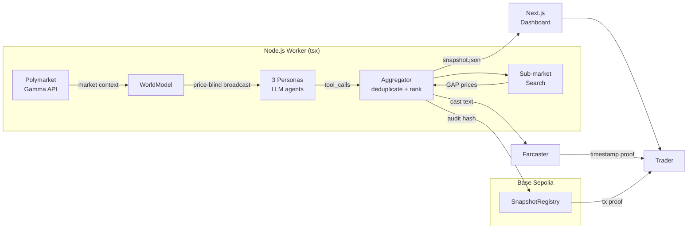
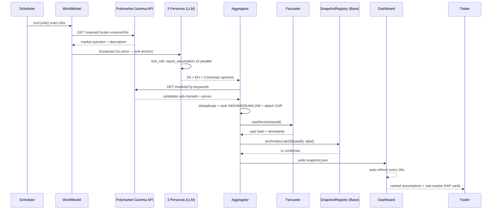

<h1 align="center">Faultline</h1>

  <strong>预测市场的地震仪 — 找到共识价格背后的断层，在它滑动之前</strong>

  <a href="https://hackcamp-w2-faultline.vercel.app">Live Demo</a> ·
  <a href="https://sepolia.basescan.org/address/0x04Ac696E4075D439841bb75b30ddEA7Cea27a67D#events">链上审计记录</a> ·
  <a href="https://github.com/programmeryuanyuan/hackcamp-w2-faultline">GitHub</a> ·
  <a href="./README.md">English</a>

  
  
  

---

## 问题 & 解决方案

**预测市场的共识价格是一个隐藏赌注** — 一个 65% 的市场并不意味着"65% 的人觉得会发生"，它意味着"市场在押注一组隐含假设同时成立"。任何一条断层滑动，价格隔夜腰斩；那些提前看到断层的人，那晚赚了 4 倍。

现有工具给你更多的概率，却不告诉你这个概率押在了什么上。LLM 一看到价格就锚定，共识再一次掩盖断层。

**Faultline 是那台地震仪。** 三个 AI 分析师（Fundamentals / Event Horizon / Contrarian）全程不知道市场价，独立读同一个市场，各自提取最脆弱的隐含假设，聚合去重后按脆弱度排名（HIGH / MEDIUM / LOW）。结果在事件揭晓前先发 **Farcaster**，再写进 **Base Sepolia** 合约 — 不是截图，是不可篡改的链上记录，让"提前看到断层"可被验证。

---

## Demo

### Live 看板

**[https://hackcamp-w2-faultline.vercel.app](https://hackcamp-w2-faultline.vercel.app)** — 实时展示当前市场的假设排名 + 子市场 GAP（每 30 秒自动刷新，无需登录）

### Demo 视频

待 D18 录制，完成后补充 Loom 链接（≤3 分钟，涵盖完整链路：市场输入 → 3 Persona 独立推理 → 排名输出 → 子市场 GAP → 链上 TX 可查）

### 链上可查

每轮审计的 keccak256 哈希写入 SnapshotRegistry，合约事件实时可查：

[`0x04Ac...a67D`](https://sepolia.basescan.org/address/0x04Ac696E4075D439841bb75b30ddEA7Cea27a67D#events) · Base Sepolia

---

## 工作原理

### 架构图

### 核心流程时序图

### 核心设计决策

- **反锚定**：三个 Persona 只收到市场问题和描述，永远看不到价格 — LLM 锚定偏差从根源切断
- **工具调用输出**：`report_assumption` function call 强制结构化输出，比 free-form chat 可靠 10 倍
- **零数据库**：审计结果写 `snapshot.json`，链上 `SnapshotRegistry` 事件作为不可篡改记录；看板直接读，无 DB 依赖

---

## 技术栈

| 层 | 技术 | 为什么 |
|----|------|--------|
| 智能合约 | Solidity（Remix 部署） | 极简 event-only，无存储，节省 gas |
| 区块链 | **Base Sepolia → Base Mainnet** | EVM 兼容 + Coinbase 生态 + 低 gas |
| AI | OpenAI 兼容 LLM（Function Calling） | 结构化 tool_call 比 chat 更可靠 + 可换模型 |
| 后端 | Node.js + TypeScript strict + **viem 2.x** | 类型安全 Web3，禁用 ethers.js |
| 代理 | undici + ProxyAgent | Polymarket 需代理，undici 原生支持 |
| 前端 | Next.js 15 App Router + Tailwind CSS v3 | Vercel 一键部署，无 SSR 依赖 |
| 时序证明 | **Farcaster（Neynar）** + SnapshotRegistry | 双锚定：社交时间戳（Cast）+ 链上哈希 |

---

## 为什么选 Base

Faultline 是原生 **Base 生态**项目，不是"顺手部署到 Base"：

- **SnapshotRegistry** 合约部署在 Base Sepolia，每轮假设审计写入一条 `SnapshotAnchored` 事件，评委在 Basescan 实时可查
- 使用 **viem 2.x**（Coinbase 官方推荐链交互库）直接调合约，零中间层
- 下一步：接入 **OnchainKit** 替换 Dashboard 钱包连接 + 合约读取，完成 Base 全栈闭环
- 核心主张与 Base "把世界经济搬上链"对齐 — AI Agent 发现隐含假设 → 链上存证 → 可被任何人验证

---

## Why Now

- AI Agent 在 2025 年大规模进入生产环境；function calling 让结构化输出稳定可靠
- Polymarket 在 2024 年美国大选期间日均交易量突破亿美元，预测市场作为信息市场进入主流视野
- Farcaster 提供了原生 Web3 社交时间戳基础设施；Base Sepolia 提供了极低成本的链上存证
- 三者同时成熟，才能组装出"反锚定审计 + 可验证时间戳"这套系统

## Why Us

独立开发者，**Faultline** 在 AIxWeb3 Hackcamp 的 14 天内从零搭建 — 从 Polymarket Gamma API 数据拉取、设计反锚定多 Persona 架构、viem + Base Sepolia 链上存证，到 Next.js 实时看板，全链路贯通。[GitHub → programmeryuanyuan](https://github.com/programmeryuanyuan)

---

## Roadmap

### 已完成（Hackcamp Week 1-3）

- [x] WorldModel：Polymarket Gamma API 轮询（每 60 秒）
- [x] 三 Persona 反锚定推理（全程不看价格）
- [x] 聚合器：去重 + 脆弱度排名（HIGH / MEDIUM / LOW）
- [x] 子市场 GAP 搜索（LLM 辅助候选筛选）
- [x] SnapshotRegistry 部署（Base Sepolia）+ 每轮审计上链
- [x] Telegram 异常告警 Agent（30 min 冷却，防骚扰）
- [x] Next.js 看板（Vercel 部署，30s 自动刷新）

### 未来 4 周

- [ ] Farcaster 预审计发帖（Neynar SDK 集成，D4 交付）
- [ ] Base Mainnet 正式上线
- [ ] OnchainKit 集成（Dashboard 钱包连接）
- [ ] 多市场并行审计（热度 Top 5）

### 3-6 个月

- [ ] 研究员身份验证（World ID）
- [ ] 假设历史追踪：跨轮次比对，找"慢慢变化的假设"
- [ ] CROO Agent Protocol — 按次收费的 Assumption Auditor API

---

## Links

- [Live Demo](https://hackcamp-w2-faultline.vercel.app)
- [链上审计记录](https://sepolia.basescan.org/address/0x04Ac696E4075D439841bb75b30ddEA7Cea27a67D#events) · Base Sepolia
- [GitHub](https://github.com/programmeryuanyuan/hackcamp-w2-faultline)
- [Alert 状态机文档](./docs/state-machine.md)
- [README 工作流留痕](./docs/readme-v2-workflow.md)
- [English Version](./README.md)

## Contact

- Email: viannluo@gmail.com

## License

MIT © 2026 Viann Luo
