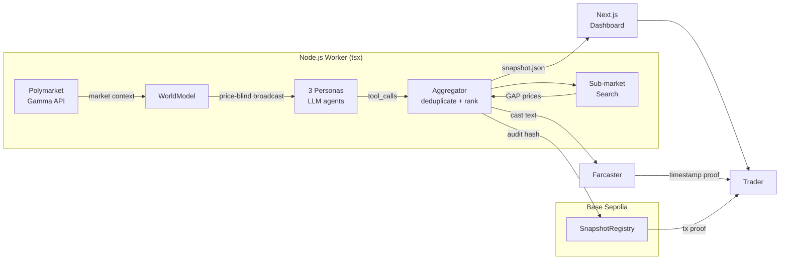
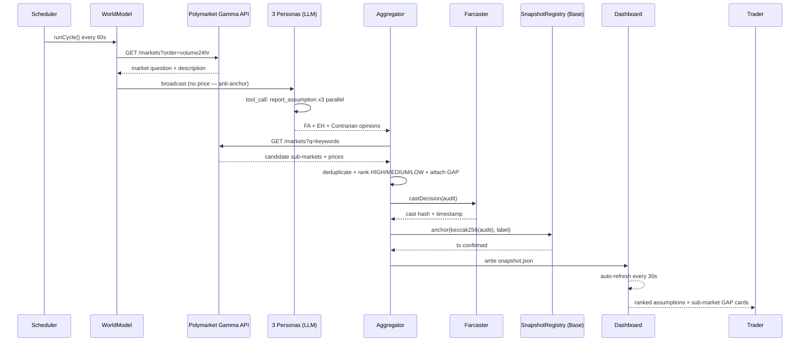

# README v2 Workflow Log (D17)

4 阶段 README 工程方法留痕。每阶段输出含人工 review 结论，确认后才进入下一阶段。

---

## 阶段 1 · 代码理解 + 体检

### AI（Claude）理解的项目概要

**项目是什么、给谁用、关键链上动作：**

Faultline 是一个面向预测市场交易员和研究员的假设审计工具。它每 60 秒拉取 Polymarket 成交量最高的二元市场，派三个 AI 角色（Fundamentals Analyst / Event Horizon / Contrarian）在完全不知道市场价格的情况下各自独立推理（反锚定），提取出该市场共识背后最脆弱的一条隐含假设，并打上 high/medium/low 的脆弱度标签。三条结果聚合去重后，再搜索 Polymarket 上是否存在直接对该假设定价的子市场，计算 GAP。最终结果写入 snapshot.json 供 Next.js 看板实时展示，同时调用 SnapshotRegistry 合约（Base Sepolia）将审计哈希上链留证。

**当前最大的 3 个文档型短板（对照 Niche 5 体检）：**

1. **无可视化架构图** — 现有 README 只有 ASCII 文字流，评委 30 秒内看不清整体结构
2. **缺"Why this fits Base / ETHGlobal"段落** — 赞助商技术栈未点名说明使用理由，评委不知道 SnapshotRegistry + viem + Base Sepolia 是核心而非凑数
3. **8 模块不完整** — 缺 Why Now / Why Us、缺 Quick Links 置顶、Demo 段落无视频/截图骨架

**评委级 8 模块中需要原创内容（代码里没有）的部分：**

- Demo 视频链接（D18 录制）和截图（需实际截图）
- Why Now 的量化背景（需可溯源数据）
- Why Us（个人/团队背景真实描述）
- Roadmap 3-6 个月段（项目愿景）

### 人工 Review 结论

理解准确，三条短板与 week3-roadmap.md Niche 5 得分（3/5）完全吻合。进入阶段 2。

---

## 阶段 2 · 中文 README 主框架

→ 见仓库根目录 `README.zh-CN.md`（最终版，已含阶段 4 修订）

**中间草稿关键决策记录：**

- Demo 视频链接保留占位，标注 `(D18 补充)`，避免写死 Loom URL 后失效
- 去掉 `docs/logo.png`（图片不存在，破链比不写更差）
- "Why this fits Base" 独立成一个段落（非 Why Now 的子段），方便直接复制进 Grant 申请表
- Farcaster 状态如实写"基础设施已接入，Neynar SDK 集成待 D4 完成"，不虚报

### 人工 Review 结论

中文版逻辑清晰，叙事与 D16 四件套对齐，"断层"类比贯通。进入阶段 3。

---

## 阶段 3 · Mermaid 图

### 图 1 · 架构图 (flowchart LR)

设计约束：≤10 节点、全英文节点名、subgraph 嵌套 ≤2 层

节点数：9（Worker 内 5 + OnChain 内 1 + 外部 3）✓

### 图 2 · 核心流程 (sequenceDiagram)

设计约束：5-8 participant、含 LLM 自循环、含链上提交步骤、结尾用户看到什么

Participant 数：8 ✓  含 LLM 自循环（`Personas->>Personas`）✓  含链上提交（Chain）✓  结尾用户看到看板卡片 ✓

### 人工 Review 结论

两张图节点数和嵌套层数均在限制内，节点名全英文，关键边有 label。进入阶段 4。

---

## 阶段 4 · 评委视角红线检查

### 4 个挑战逐条审查

**挑战 1：前 30 秒能否决定"要不要继续看"？**

- 体感分：4/5
- 初始扣分：Quick Links 顶部 Demo 视频是占位，真实用户点击失败
- 修改：加括号标注 `(video coming D18)` 而非留死链；Live Demo 链接优先展示

**挑战 2：How it Works 能否 1 分钟读懂架构？**

- 体感分：4/5
- 初始扣分：只有 flowchart，缺时序图，评委看不出"什么时候对链上提交"
- 修改：加入 sequenceDiagram，补充"Why this stack"三条核心设计决策

**挑战 3：Why Us + Roadmap 能否说服 Grant Council 长期 follow through？**

- 体感分：3/5
- 扣分：Why Us 只有"14 天内从零搭建"，缺可验证的链接（GitHub 主页）
- 修改：加 GitHub 链接 + "full-stack from Gamma API to Base Sepolia" 具体描述

**挑战 4：Sponsor 评委（Coinbase/Base）能找到"为什么用我家技术栈"这段吗？**

- 初始扣分：原 README 只在 Tech Stack 表格里写了 "Base Sepolia"，没有单独段落
- 修改：加独立的 **Why This Fits Base** 段落，逐条列出 viem / SnapshotRegistry / OnchainKit 路径

### 修改总结

所有 4 条问题均已在 README.md 和 README.zh-CN.md 的最终版中修正。v2 改动列表：
1. Demo 视频占位改为带说明的文字（非死链）
2. 加 sequenceDiagram
3. Why Us 加可验证 GitHub 链接
4. 独立 "Why This Fits Base" 段落
