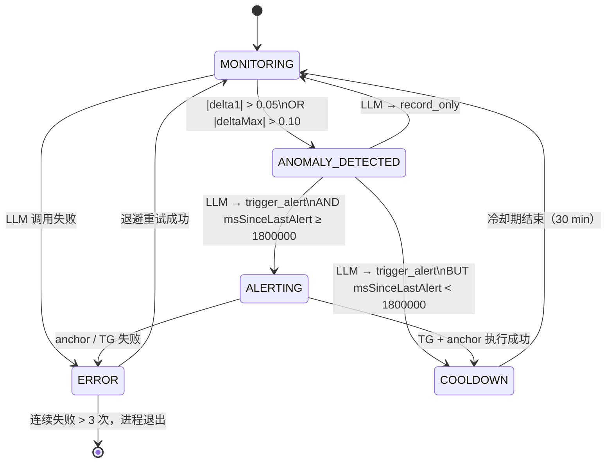

# Faultline Worker — Alert Agent State Machine

**场景**：预测市场价格异常监控 Agent，持续轮询价格，识别突变，决策告警并链上留痕，告警后进入冷却避免骚扰。

---

## Mermaid 状态图



---

## TypeScript 枚举 + transition 函数模板

```typescript
export enum AgentState {
  MONITORING        = 'MONITORING',
  ANOMALY_DETECTED  = 'ANOMALY_DETECTED',
  ALERTING          = 'ALERTING',
  COOLDOWN          = 'COOLDOWN',
  ERROR             = 'ERROR',
}

export type StateContext = {
  delta1:           number
  deltaMax:         number
  msSinceLastAlert: number
  llmAction:        'trigger_alert' | 'record_only' | null
  alertSuccess:     boolean
  errorCount:       number
  cooldownRemainingMs: number
}

export function transition(state: AgentState, ctx: StateContext): AgentState {
  switch (state) {
    case AgentState.MONITORING:
      if (ctx.llmAction === null)  return AgentState.ERROR
      if (Math.abs(ctx.delta1)  > 0.05 ||
          Math.abs(ctx.deltaMax) > 0.10)  return AgentState.ANOMALY_DETECTED
      return AgentState.MONITORING

    case AgentState.ANOMALY_DETECTED:
      if (ctx.llmAction === 'record_only') return AgentState.MONITORING
      if (ctx.llmAction === 'trigger_alert') {
        return ctx.msSinceLastAlert >= 1_800_000
          ? AgentState.ALERTING
          : AgentState.COOLDOWN
      }
      return AgentState.ERROR

    case AgentState.ALERTING:
      return ctx.alertSuccess ? AgentState.COOLDOWN : AgentState.ERROR

    case AgentState.COOLDOWN:
      return ctx.cooldownRemainingMs <= 0
        ? AgentState.MONITORING
        : AgentState.COOLDOWN

    case AgentState.ERROR:
      if (ctx.errorCount > 3) throw new Error('[agent] too many consecutive errors')
      return AgentState.MONITORING
  }
}
```

---

## 各状态下 LLM 可用工具子集

| 状态 | 可用工具 | 说明 |
|------|----------|------|
| `MONITORING` | `record_only` | 稳定期只允许记录，不允许告警 |
| `ANOMALY_DETECTED` | `trigger_alert`, `record_only` | 检测到异常，LLM 决策是否升级 |
| `ALERTING` | _(无 LLM 调用)_ | 纯执行：发 TG、anchor 上链 |
| `COOLDOWN` | `record_only` | 冷却期内屏蔽 trigger_alert，防止重复告警 |
| `ERROR` | _(无 LLM 调用)_ | 退避重试，不再消耗 LLM 配额 |

> **设计原则**：`trigger_alert` 权限只在 `ANOMALY_DETECTED` 状态开放。
> 其他状态即使 LLM 想调用也会被 transition 函数拦截，不依赖 prompt 约束。

---

## 与现有代码的对应关系

| 状态机节点 | 代码位置 |
|------------|----------|
| MONITORING → ANOMALY_DETECTED 条件 | `alert-anomaly.ts` `delta1` / `deltaMax` 计算 |
| LLM 决策 | `llm.ts` `decide()` |
| ALERTING 执行 | `alert-anomaly.ts` `trigger_alert` handler |
| COOLDOWN 计时 | `alert-anomaly.ts` `lastAlertedAt` + `MIN_ALERT_INTERVAL_MS` |
| ERROR 退避 | `utils.ts` `withRetry()` |
